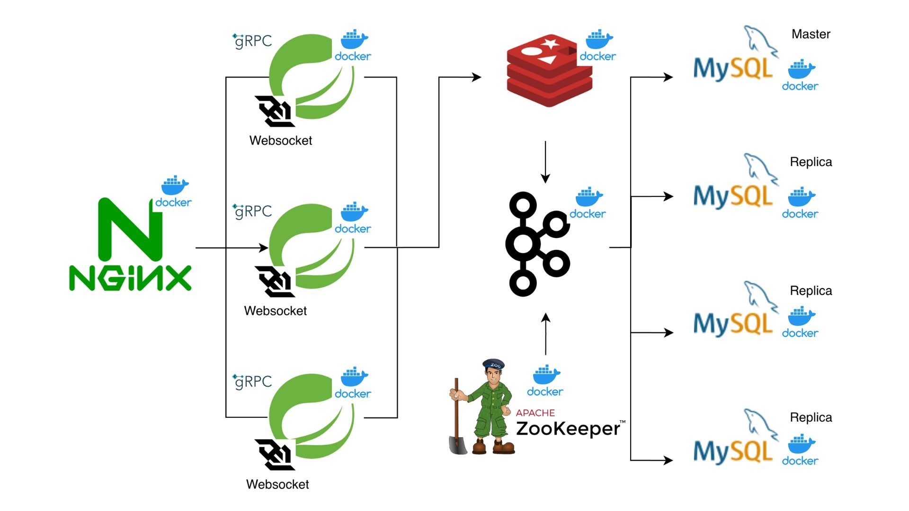

# 🚀 MiniChat - 대규모 트래픽 처리를 위한 실시간 채팅 서버

> **대규모 동시 접속 환경을 가정하여 데이터 정합성과 시스템 안정성 확보에 주력한 백엔드 서버**
>  
> Master-Replica DB 구조와 Redis/Kafka 분산 처리 아키텍처를 도입하여, 실시간성과 대용량 트래픽 처리에 최적화된 서비스를 구현했습니다.

 

## 🛠 Architecture

 

## 📚 Tech Stack

### Backend
   

### Infrastructure & Messaging
  

### Protocol
 

 

## 💡 Key Features (구현 기능)

### 1. DB 부하 분산 및 트랜잭션 최적화
* **Master-Replica 구조:** `AbstractRoutingDataSource`를 활용하여 쓰기 작업(Master)과 읽기 작업(Replica)의 트랜잭션을 분리, DB 부하를 효과적으로 분산했습니다.
* **JPA 최적화:** 복합 인덱스 및 Pagination을 적용하여 대량의 데이터 조회 시 API 평균 응답 시간을 최적화했습니다.

### 2. 동시성 제어 (Concurrency Control)
* **Redis Lua Script:** 원자성(Atomicity)을 보장하는 Lua Script를 활용하여 고성능 Rate Limiter를 구현했습니다.
* **낙관적 락(Optimistic Lock):** 조건부 업데이트 로직을 통해 데이터 경합 상황에서도 정합성을 유지하도록 설계했습니다.

### 3. 고성능 실시간 통신
* **WebSocket & gRPC:** WebSocket으로 클라이언트와 연결하고, 서버 간 메시지 릴레이에는 Protobuf 기반의 gRPC를 사용하여 네트워크 오버헤드를 최소화하고 지연 시간(Latency)을 줄였습니다.
* **분산 세션 관리:** Redis를 활용하여 다중 서버 환경에서도 끊김 없는 채팅 세션을 유지합니다.

### 4. 비동기 이벤트 처리 (Event-Driven)
* **Kafka 활용:** 채팅 전송과 채팅방 목록 업데이트 로직을 Kafka 이벤트로 분리하여 서비스 간 결합도를 낮추고(Decoupling), 시스템의 확장성을 확보했습니다.

 

## 🚧 Technical Challenge (해결 과제 및 추후 개선 방향)

### **단일 레디스 서버의 제약**
* **문제 상황:** 단일 Redis 서버 운영 중 트래픽 증가에 따른 확장성 제약 발생. 
* **해결 방안:** Redis Cluster 도입을 통한 부하 분산 처리.
* **직면 과제:** 클러스터 내 데이터 샤딩으로 인해 여러 노드에 걸쳐 있는 데이터에 대한 Lua Script 연산(Cross-slot error) 불가능.
* **상세 해결:** **Redis Hashtag**(`{...}`)를 활용하여 특정 비즈니스 로직에 필요한 데이터들을 동일한 해시 슬롯 및 노드로 강제 배치하여 원자성 확보 

 

## 📈 Performance & Improvements (성능 개선 및 배운 점)

| 이슈 및 목표 | 해결 과정 및 결과 |
| :--- | :--- |
| **알고리즘 최적화** | 기존 연산 로직을 **누적 합계 알고리즘**으로 개선하여 연산 효율 극대화 |
| **쿼리 튜닝** | 조회 쿼리에 **복합 인덱스** 적용 및 페이징 처리를 통해 쿼리 실행 계획 최적화 |
| **캐싱 전략 고도화** | 빈번한 쓰기 작업에 대해 **Redis Write-Back** 전략을 도입, DB 부하 감소 및 응답 속도 개선 |
| **네트워크 비용** | JSON 기반 통신 대비 **gRPC** 도입으로 데이터 직렬화 크기를 줄여 릴레이 성능 최적화 |
